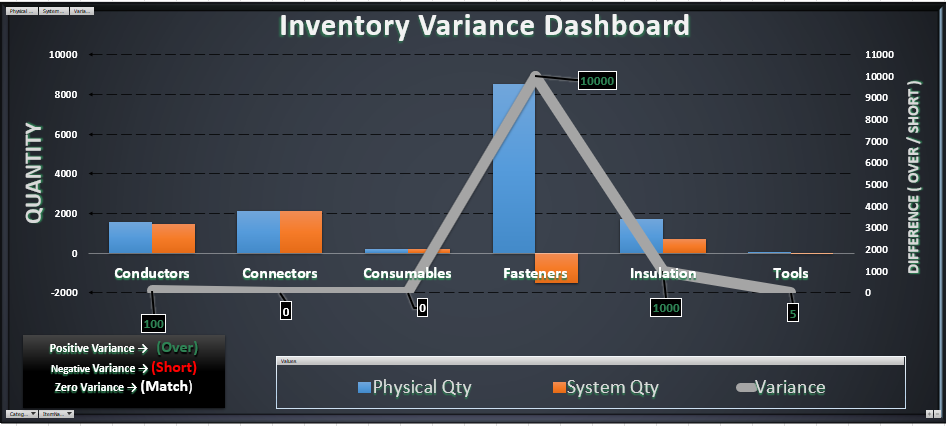
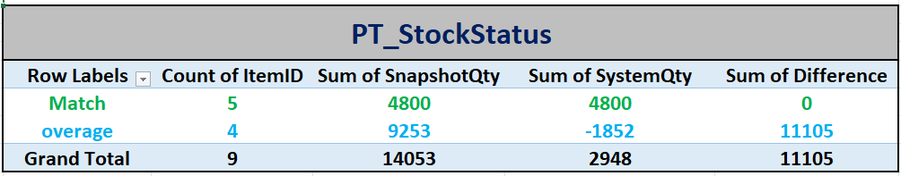
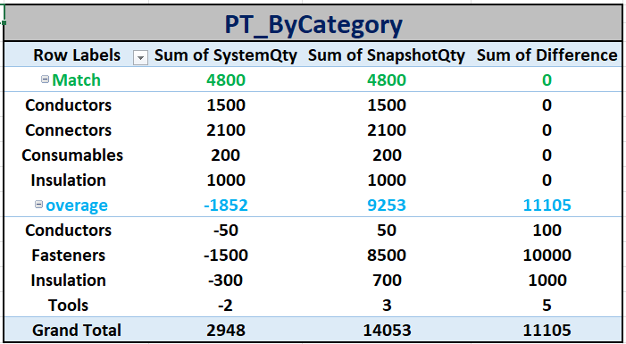
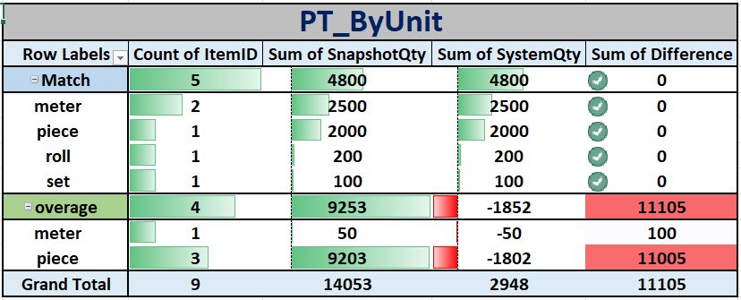
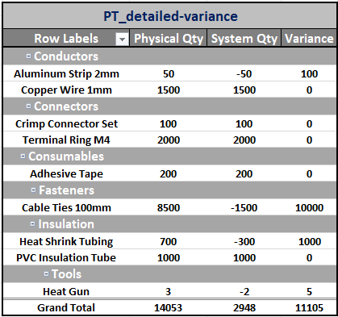
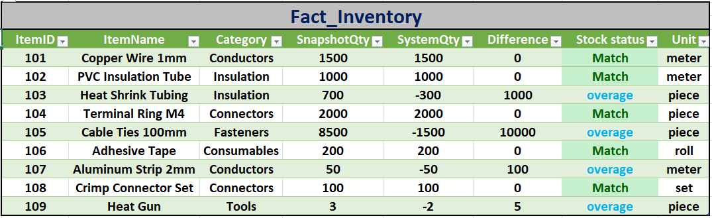

# Inventory Variance Analysis Dashboard

**Comprehensive Excel project for analyzing inventory discrepancies in warehouse and supply chain operations.**

## 📋 Project Overview
This project presents a complete **Inventory Variance Analysis** between physical stock counts (SnapshotQty) and system-recorded quantities (SystemQty). The goal is to identify, quantify, and categorize inventory discrepancies to support better inventory control and decision-making.

## 🎯 Business Problem
Inventory inaccuracies lead to financial losses, operational inefficiencies, and poor forecasting. This analysis helps detect overages and mismatches to improve stock accuracy.

## 🛠️ Tools & Technologies Used
- Microsoft Excel
- Power Query (Data cleaning & transformation)
- Pivot Tables (Multi-dimensional analysis)
- Interactive Dashboard with Slicers
- Charts & Conditional Formatting

## 📊 Key Insights
- **Total Variance**: 11,105 units (primarily Overage)
- **Match Items**: 5 items with perfect alignment
- **Overage Items**: 4 items showing significant discrepancies
- Highest variance in **Fasteners** category (10,000 units)
- Notable issues in **Insulation** and **Conductors** categories

## 🖼️ Project Screenshots

### Main Dashboard

### Analysis by Stock Status

### Analysis by Category

### Analysis by Unit

### Detailed Variance by Category

### Raw Source Data

